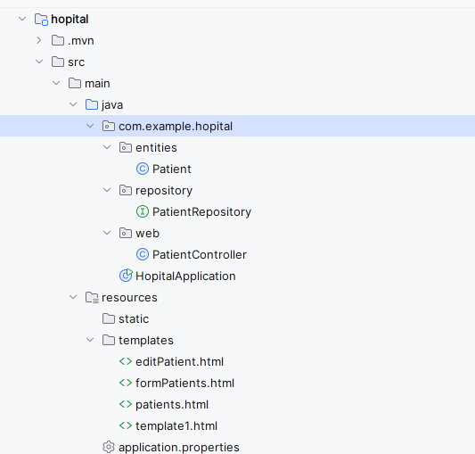
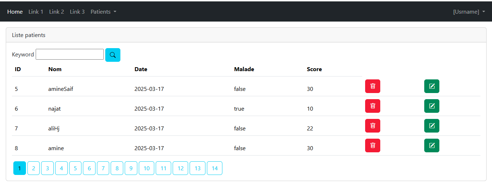
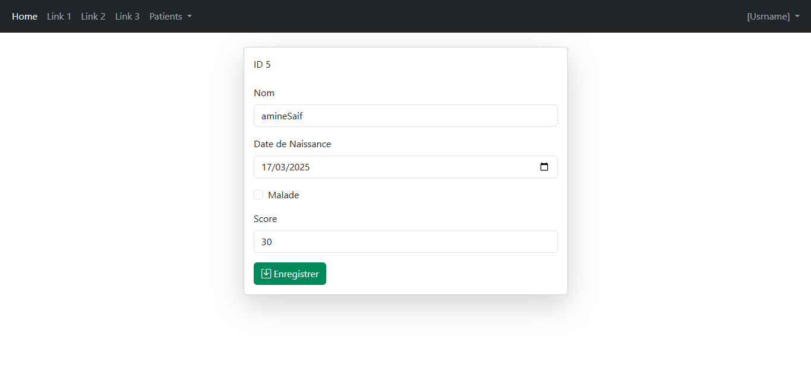
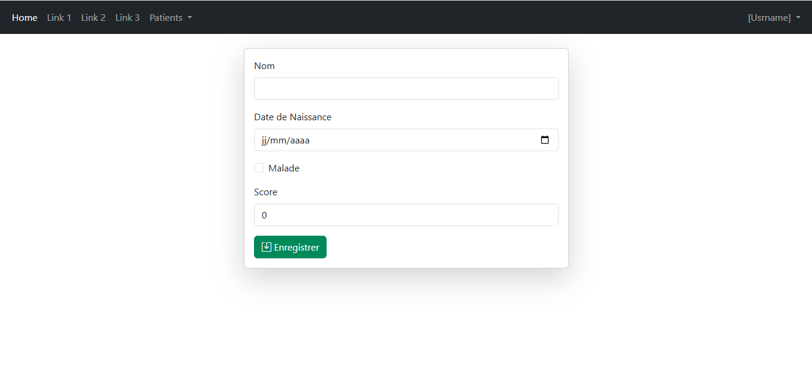

# TP3---Spring_MVC_Spring_Data_JPA_Thymeleaf
## Patient Management
This is a **Spring Boot** web application for managing patients. It allows users to:
- View a list of patients with pagination.
- Search for patients by name.
- Add, edit, and delete patients.
- Validate input data before submission.
## Technologies Used
- **Spring Boot** (Main framework)
- **Spring MVC** (Request handling and model management)
- **Spring Data JPA** (Database interactions)
- **Thymeleaf** (Template engine for frontend views)
- **H2 Database** (In-memory database, can be replaced with MySQL/PostgreSQL)
- **Bootstrap** (Responsive design and styling)
##  Project Structure
   
###  `application.properties`
```properties
spring.application.name=hopital
server.port=8084
spring.datasource.url=jdbc:mysql://localhost:3306/hopital-db?createDatabaseIfNotExist=true
spring.datasource.username=root
spring.datasource.password=
spring.jpa.hibernate.ddl-auto=update
spring.jpa.properties.hibernate.dialect=org.hibernate.dialect.MariaDBDialect
```
##  Entities 
### `Patient`
```java
@Entity
@NoArgsConstructor
@AllArgsConstructor
@Data
public class Patient {
    @Id
    @GeneratedValue(strategy = GenerationType.IDENTITY)
    private Long id;
    @NotEmpty
    @Size(min = 4,max = 30)
    private String nom;
    @Temporal(TemporalType.DATE)
    @DateTimeFormat(pattern = "yyyy-MM-dd")
    private Date dateNaissance;
    private boolean malade;
    @DecimalMin("7")
    private int score;
}
```
## PatientController
Controller for Managing Patients
```java
@Controller
@AllArgsConstructor
public class PatientController {
    private PatientRepository patientRepository;
     @GetMapping("/index")
    public String index(Model model,
                        @RequestParam(name = "page",defaultValue = "0")int p,
                        @RequestParam(name = "size",defaultValue = "4")int s  ,
                        @RequestParam(name = "keyword",defaultValue = "")String kw
                        ){
         Page<Patient> patientPage=patientRepository.findByNomContains(kw,PageRequest.of(p,s));
         model.addAttribute("listPatients",patientPage.getContent());
         model.addAttribute("pages",new int[patientPage.getTotalPages()]);
         model.addAttribute("currentPage",p);
         model.addAttribute("keyword",kw);
         return "patients";

     }

    @GetMapping("/delete")
    public String  delete(@RequestParam("id") Long id,
                          @RequestParam(name = "keyword", defaultValue = "") String keyword,
                          @RequestParam(name = "page", defaultValue = "0") int p) {
         patientRepository.deleteById(id);
         return "redirect:/index?page=" + p + "&keyword=" + keyword;}

    @GetMapping("/")
    public String  home() {
        return "redirect:/index";}
    @GetMapping("/patients")
    @ResponseBody
    public List<Patient> listPatients(){
         return  patientRepository.findAll();
    }
  @GetMapping("/formPatients")
public String formPatients(Model model){
         model.addAttribute("patient",new Patient());
return "formPatients";
}
@PostMapping(path="/save")
public String save(Model model, @Valid Patient par, BindingResult bindingResult ,
                   @RequestParam(defaultValue = "0") int page,
                   @RequestParam(defaultValue = "")String keyword){
    if (bindingResult.hasErrors()) {
        return "formPatients";
    }
         patientRepository.save(par);

    return "redirect:/index?page=" + page + "&keyword=" + keyword;

}
    @GetMapping("/editPatient")
    public String editPatient(Model model,Long id,String keyword,int page){
         Patient patient=patientRepository.findById(id).orElse(null);
         if (patient==null) throw new RuntimeException("Patient intouvable");
        model.addAttribute("patient",patient);
        model.addAttribute("page",page);
        model.addAttribute("keyword",keyword);
        return "editPatient";
    }
}
```
###  Features of the Controller:
- **List patients** with pagination and search functionality.
- **Add and edit patients** using a form with validation.
- **Delete patients** from the database.

##Application Screenshots
### 🏠 Home Page (`/index`)    

### ✏ Edit Patient (`/editPatient`)   

### ➕ Add New Patient (`/formPatients`) 
 
